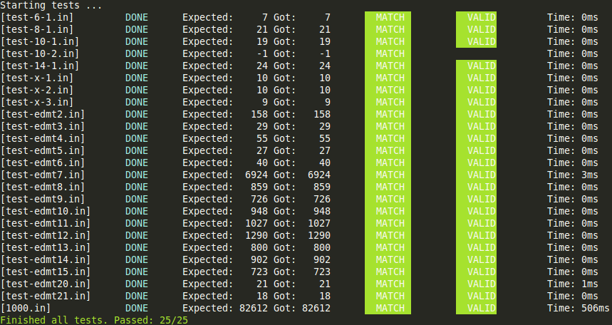

Edmonds' algorithm
==================

Implementation of Edmonds' blossom algorithm for finding minimum weight perfect matching on graphs in less than 1k SLOC.

Written as project for a class. Licensed under the MIT License.

Measurements
------------

Timed and verified with `(time ./main < input > out) && head -n 1 out`.

|Vertices | Edges | Time |
|--------:|------:|-----:|
| 1 000   | 10 495 | 500ms|
| 1 002   | 501 501| 18s  |
| 10 000  | 504 929| 4m 27s|

Testing
-------

File `test.cpp` implements simple "unit" testing with the 25 provided test cases, with the expected outcomes computed by an independent implementation:

Tested with Valgrind for memory leaks and invalid memory reads/writes.

Code coverage tested with `lcov`, implementation has 100% coverage but is reported slightly lower, see the [report](https://lacop.github.io/edmonds/).

Usage
-----

I don't recommend using this for anything serious since there are faster and more tested implementations. If you still wish to do so, refer to `main.cpp`.

To build simply run `cmake .` and then `make`. If you don't have/like cmake just build and link `main.cpp` or `test.cpp` with all other files.
